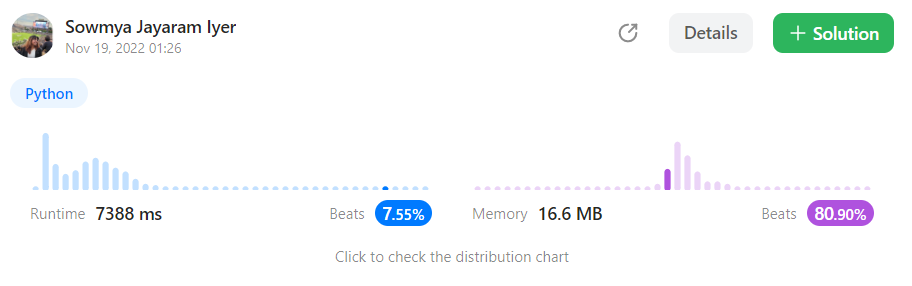

# 15. 3Sum


Given an integer array nums, return all the triplets `[nums[i], nums[j], nums[k]]` such that `i != j`, `i != k`, and `j != k`, and `nums[i] + nums[j] + nums[k] == 0`.

Notice that the solution set must not contain duplicate triplets.

&#x20;

**Example 1:**

<pre><code>Input: nums = [-1,0,1,2,-1,-4]
<strong>Output:
</strong> [[-1,-1,2],[-1,0,1]]
<strong>Explanation:
</strong> 
nums[0] + nums[1] + nums[2] = (-1) + 0 + 1 = 0.
nums[1] + nums[2] + nums[4] = 0 + 1 + (-1) = 0.
nums[0] + nums[3] + nums[4] = (-1) + 2 + (-1) = 0.
The distinct triplets are [-1,0,1] and [-1,-1,2].
Notice that the order of the output and the order of the triplets does not matter.</code></pre>

**Example 2:**

<pre><code>Input: nums = [0,1,1]
<strong>Output:
</strong> []
<strong>Explanation:
</strong> The only possible triplet does not sum up to 0.</code></pre>

**Example 3:**

<pre><code>Input: nums = [0,0,0]
<strong>Output:
</strong> [[0,0,0]]
<strong>Explanation:
</strong> The only possible triplet sums up to 0.</code></pre>

```python
class Solution(object):
    def threeSum(self, nums):
        """
        :type nums: List[int]
        :rtype: List[List[int]]
        """
        # n=len(nums)
        # result=[]
        # for i in range(n-2):
        #     for j in range(i+1,n-1):
        #         for k in range(i+2,n):
        #             if i!=j and i!=k and j!=k:
        #                 if nums[i]+nums[j]+nums[k] == 0:
        #                             # if any(list == list_search for list in Input):
        #                     if not any(set(x)==set([nums[i],nums[j],nums[k]]) for x in result):
        #                         result.append([nums[i],nums[j],nums[k]])
        # return result
        if len(nums) < 3:
            return []

        nums.sort()
        result = []

        for i in range(len(nums)):
            l = i + 1
            r= len(nums) - 1 
            while r> l:
                if  nums[i] + nums[l] + nums[r] == 0:
                    if [nums[i], nums[l], nums[r]] not in result:
                        result.append([nums[i], nums[l], nums[r]])
                    l += 1
                    r -= 1
                    
                elif nums[i] + nums[l] + nums[r] > 0:
                    r -= 1
                else :
                    l += 1

        return result

```

<figure><figcaption></figcaption></figure>
