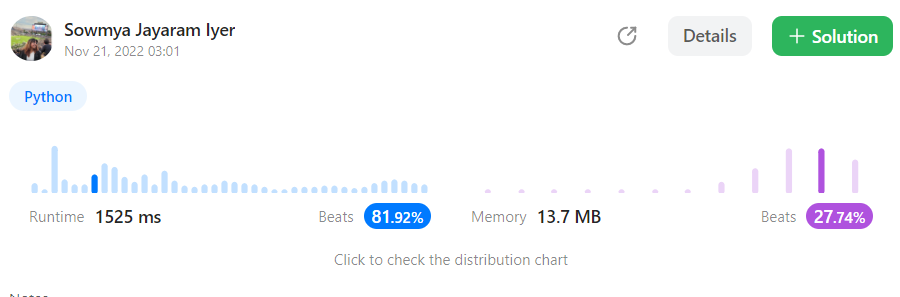

# 16. 3Sum Closest


Given an integer array `nums` of length `n` and an integer `target`, find three integers in `nums` such that the sum is closest to `target`.

Return _the sum of the three integers_.

You may assume that each input would have exactly one solution.

&#x20;

**Example 1:**

<pre><code>Input: nums = [-1,2,1,-4], target = 1
<strong>Output:
</strong> 2
<strong>Explanation:
</strong> The sum that is closest to the target is 2. (-1 + 2 + 1 = 2).</code></pre>

**Example 2:**

<pre><code>Input: nums = [0,0,0], target = 1
<strong>Output:
</strong> 0
<strong>Explanation:
</strong> The sum that is closest to the target is 0. (0 + 0 + 0 = 0).</code></pre>

```python
class Solution(object):
    def threeSumClosest(self, nums, target):
        """
        :type nums: List[int]
        :type target: int
        :rtype: int
        """
        nums.sort()
        n = len(nums)
        result = nums[0] + nums[1] + nums[n - 1]
        for i in range(0, n - 2):
            l = i + 1
            r = n - 1
            while l < r:
                s = nums[i] + nums[l] + nums[r]
                if s < target:
                    l += 1
                elif s==target:
                    return s
                else:
                    r -= 1
                if abs(result - target) > abs(s - target):
                    result = s
        return result
```

<figure><figcaption></figcaption></figure>
