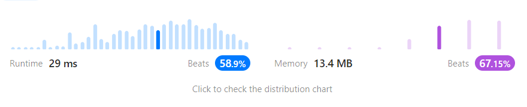

# 17. Letter Combinations of a Phone Number

Given a string containing digits from `2-9` inclusive, return all possible letter combinations that the number could represent. Return the answer in **any order**.

A mapping of digits to letters (just like on the telephone buttons) is given below. Note that 1 does not map to any letters.


**Example 1:**

<pre><code>Input: digits = "23"
<strong>Output:
</strong> ["ad","ae","af","bd","be","bf","cd","ce","cf"]</code></pre>

**Example 2:**

<pre><code>Input: digits = ""
<strong>Output:
</strong> []</code></pre>

**Example 3:**

<pre><code>Input: digits = "2"
<strong>Output:
</strong> ["a","b","c"]</code></pre>

```python
import itertools
class Solution(object):
    def letterCombinations(self, digits):
        """
        :type digits: str
        :rtype: List[str]
        """
        pmap={"1":[],"2":['a','b','c'],"3":['d','e','f'],"4":['g','h','i'],"5":['j','k','l'],"6":['m','n','o'],"7":['p','q','r','s'],"8":['t','u','v'],"9":['w','x','y','z']}

        if len(digits)==0 or digits=='1':
            return []
        elif len(digits)==1:
            return pmap[digits]
        else:
            lists=[]
            for i in digits:
                lists.append(pmap[i])
            result = list(''.join(p) for p in itertools.product(*lists))
            return result

```

<figure><figcaption></figcaption></figure>
