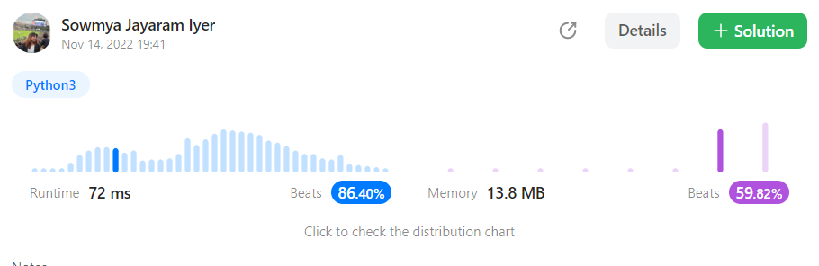

# 9. Palindrome Number

Given an integer `x`, return `true` _if_ `x` _is a_&#x20;

_**palindrome**, and_ `false` _otherwise_.

&#x20;

**Example 1:**

<pre><code>Input: x = 121
<strong>Output:
</strong> true
<strong>Explanation:
</strong> 121 reads as 121 from left to right and from right to left.</code></pre>

**Example 2:**

<pre><code>Input: x = -121
<strong>Output:
</strong> false
<strong>Explanation:
</strong> From left to right, it reads -121. From right to left, it becomes 121-. Therefore it is not a palindrome.</code></pre>

**Example 3:**

<pre><code>Input: x = 10
<strong>Output:
</strong> false
<strong>Explanation:
</strong> Reads 01 from right to left. Therefore it is not a palindrome.</code></pre>

```python
class Solution:
    def isPalindrome(self, x: int) -> bool:
        if x<0:
            return False
        elif x==0:
            return True
        else:
            if x == int(str(x)[::-1]):
                return True
            else:
                return False
```

<figure><figcaption></figcaption></figure>
